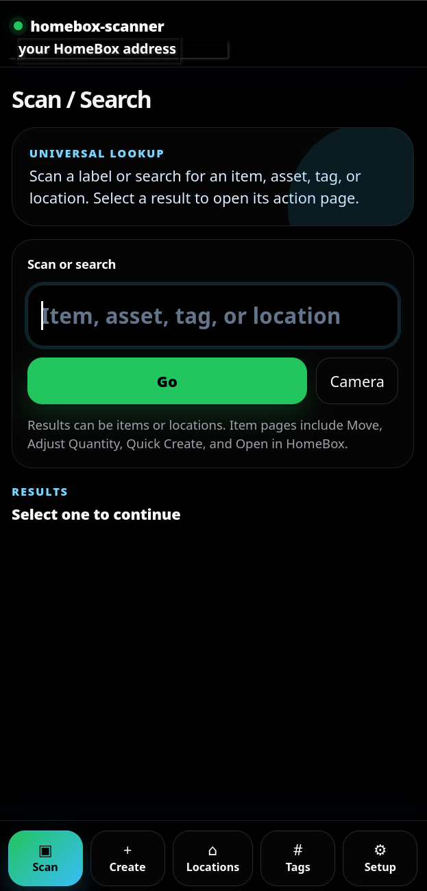

# homebox-scanner

## Local development against a real HomeBox

If direct browser requests fail with `NetworkError when attempting to fetch resource`, that is usually CORS or certificate trust.

Use the built-in Vite dev proxy:

1. Copy `.env.example` to `.env`
2. Set `VITE_HB_USE_DEV_PROXY=true`
3. Set `VITE_HB_PROXY_TARGET=https://YOUR_HOMEBOX_HOST:PORT`
4. Restart `npm run dev`

With proxy mode on, the browser calls the local Vite server and Vite forwards to HomeBox. Your Setup screen should still use the real HomeBox base URL, not `/hb-api`.

A scanner-first, mobile-first progressive web app that sits on top of HomeBox and keeps HomeBox as the system of record.

## Screenshots and walkthrough

See [docs/WALKTHROUGH.md](docs/WALKTHROUGH.md) for a screenshot-guided walkthrough of the mobile workflow.




## What this MVP does

- Username/password connection to a HomeBox instance
- Bearer tokens stored for the browser session by default, with opt-in “Remember this device” persistence
- Mock mode for development when live API is unavailable
- Large scanner-first input with automatic submit on Enter
- Item detail view with tags, quantity, current location, notes, and photo support
- Move workflow: scan item -> scan destination location -> confirm
- Adjust quantity workflow with optional note append to HomeBox notes
- Quick create workflow with optional barcode association and photo upload
- Location lookup and item listing by location
- Tag lookup and item listing by tag
- Audio + visual feedback for success and error events
- PWA installability

## Important deployment note

This app is front-end only. That keeps it simple, but it also means the browser talks directly to HomeBox.

For best results, serve this app on the same origin as HomeBox or behind the same reverse proxy path/domain. If you host it on a different origin, verify your HomeBox instance allows cross-origin requests for:

- `POST /api/v1/users/login`
- `GET /api/v1/status`
- authenticated `GET/POST/PATCH/PUT` calls under `/api/v1/*`

## Environment variables

Copy `.env.example` to `.env` if you want build-time defaults.

For a subpath deployment, this project now defaults to `/homebox-scanner/`. Set `VITE_APP_BASE_PATH=/` if serving from a domain root.

- `VITE_APP_TITLE` - app name shown in the UI
- `VITE_APP_BASE_PATH` - base path for routing/PWA scope, defaulting to `/homebox-scanner/` in example production config
- `VITE_HB_DEFAULT_BASE_URL` - optional default HomeBox base URL
- `VITE_HB_MOCK_MODE` - set to `true` to start in mock mode by default
- `VITE_HB_OPEN_ENTITY_URL_TEMPLATE` - optional deep link template for "Open in HomeBox"

## Run locally

```bash
npm install
npm run dev
```

Open `http://localhost:5173`.

## Production build

```bash
npm install
npm run build
npm run preview
```

## Docker

```bash
docker compose up --build -d
```

Open `http://localhost:8080`.

## HomeBox API assumptions used in this project

This MVP is based on the currently published HomeBox swagger/OpenAPI spec.

- API base path: `/api`
- Login: `POST /api/v1/users/login`
- Entity search/create: `GET/POST /api/v1/entities`
- Entity read/update/patch: `GET/PUT/PATCH /api/v1/entities/{id}`
- Location tree: `GET /api/v1/entities/tree`
- Entity path lookup: `GET /api/v1/entities/{id}/path`
- Tags: `GET/POST /api/v1/tags`
- Entity types: `GET /api/v1/entity-types`
- Asset-code lookup: `GET /api/v1/assets/{id}`
- Attachment upload: `POST /api/v1/entities/{id}/attachments`
- QR and label helpers:
  - `GET /api/v1/qrcode`
  - `GET /api/v1/labelmaker/item/{id}`
  - `GET /api/v1/labelmaker/location/{id}`

## Label strategy

The app supports several scan formats:

1. Custom stable formats:
   - `HBX:ITEM:<entity-id>`
   - `HBX:LOC:<entity-id>`

2. Full URLs:
   - If the scanned value contains an entity ID in the path or query string, the app will try to extract it

3. Asset codes:
   - Fallback to `/api/v1/assets/{code}`

4. General text:
   - Fallback to `/api/v1/entities?q=<scan>`

### Recommendation

For a scanner-first workflow, use custom QR payloads for your own labels unless you verify your installed HomeBox version's native label output is exactly what you want to scan long-term.

A practical pattern is:

- item label -> `HBX:ITEM:<entity-id>`
- location label -> `HBX:LOC:<entity-id>`

Those can be rendered either by your own label system or by calling HomeBox's QR endpoint with the `data` parameter.

## How to inspect your live HomeBox instance before tightening the next iteration

1. Open your instance's swagger UI:
   - `https://YOUR_HOMEBOX/api/swagger/`

2. Test:
   - `GET /api/v1/status`
   - `POST /api/v1/users/login`
   - `GET /api/v1/entity-types`
   - `GET /api/v1/entities/tree`
   - `GET /api/v1/tags`

3. Pick one known item and one known location, then inspect:
   - `GET /api/v1/entities/{id}`
   - `GET /api/v1/entities/{id}/path`
   - `GET /api/v1/labelmaker/item/{id}`
   - `GET /api/v1/labelmaker/location/{id}`

4. Actually scan the rendered QR/label and record the raw scanned value. That tells us whether native labels are good enough or whether the custom `HBX:*` format should be enforced.

## Known MVP constraints

- OIDC login is not implemented in this build. This version uses HomeBox username/password login or mock mode.
- This is a browser-only app. Treat the browser/device as trusted; do not use persistent login on shared devices.
- "Open in HomeBox" deep-linking is only exact if `VITE_HB_OPEN_ENTITY_URL_TEMPLATE` is configured.
- Quantity adjustment notes are only persisted when the user explicitly chooses to append them to the HomeBox notes field.
- Camera scanning relies on the browser's `BarcodeDetector` support and is optional.

- Find this useful? Feel free to donate https://buymeacoffee.com/rarecore
