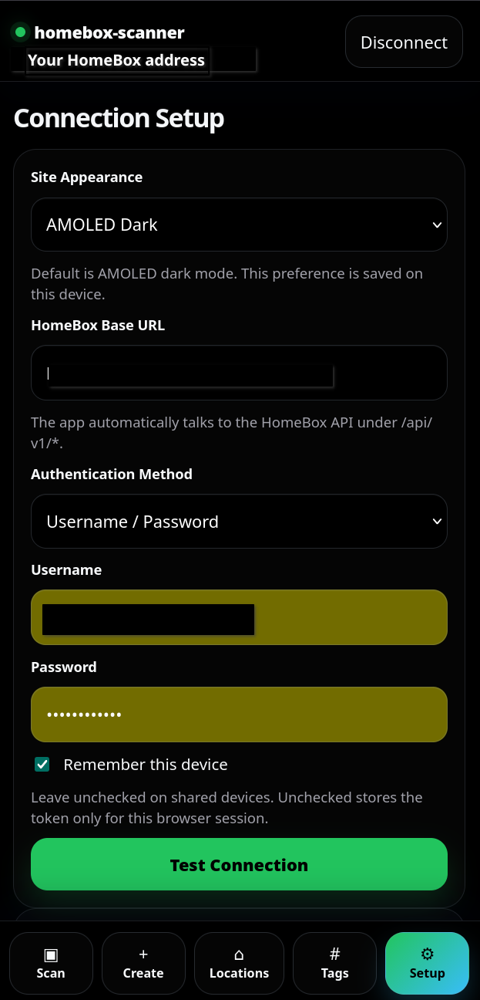
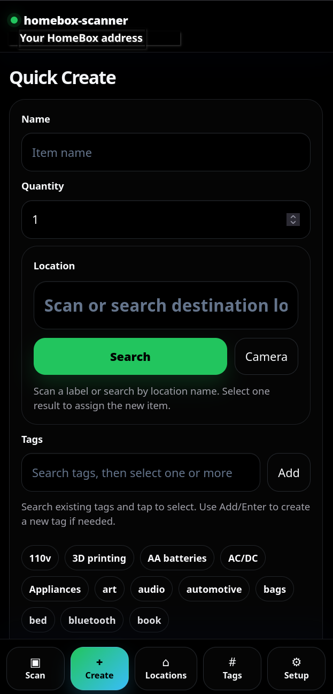
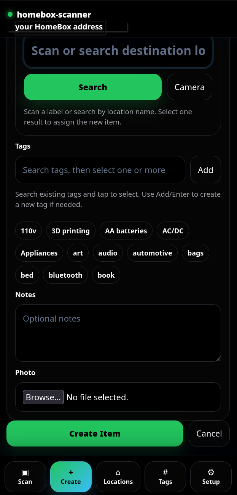
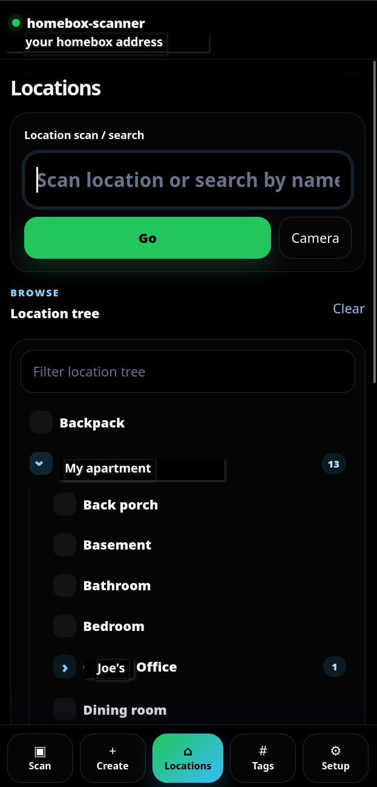
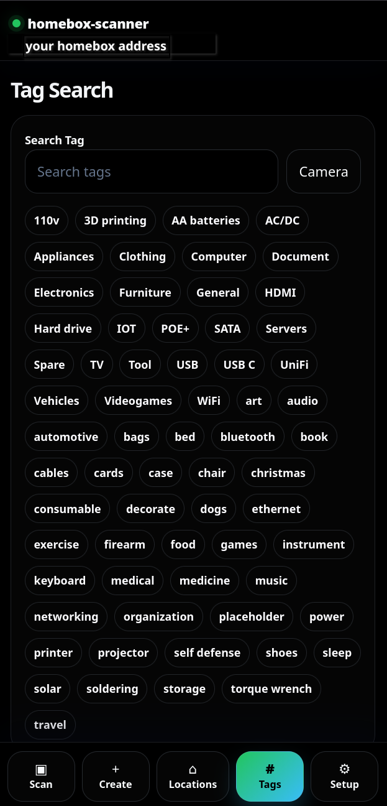

# HomeBox Scanner walkthrough

HomeBox Scanner is a mobile-first companion app for HomeBox. It is designed for fast inventory work from a phone: scan/search, create items, browse locations, find tagged items, and keep HomeBox as the source of truth.

The screenshots below show the dark mobile UI using the bottom navigation bar: **Scan**, **Create**, **Locations**, **Tags**, and **Setup**.

## 1. Connect to HomeBox

Open **Setup** first and enter your HomeBox base URL. Choose the authentication method, sign in with your HomeBox credentials, and optionally enable **Remember this device** for persistent login on trusted devices.

Use **Test Connection** to verify the app can reach the HomeBox API before starting inventory work.

## 2. Scan or search anything

The **Scan / Search** screen is the main workflow entry point. Scan a label with the camera or type/search for an item, asset, tag, or location.

Results open the relevant action page so you can quickly inspect an item, move it, adjust quantity, or jump into HomeBox when needed.

## 3. Quickly create a missing item

Use **Create** when you discover an item that is not in HomeBox yet. Enter a name and quantity, then scan or search for the destination location.

The form also supports selecting existing tags or adding new tags as you go, which keeps field entry fast without needing to switch back to the full HomeBox UI.

## 4. Add notes and a photo before saving

The lower half of **Quick Create** lets you add optional notes and attach a photo. Tap **Create Item** when the item has its location, tags, notes, and optional image ready.

## 5. Browse or scan locations

The **Locations** page supports both direct scan/search and a browsable nested location tree. Expand a parent location to drill into rooms, containers, shelves, or any other HomeBox location hierarchy.

Use the location filter to narrow the tree when the inventory has many places.

## 6. Search by tag

The **Tags** page shows available tags as tappable chips and also supports camera/search input. Selecting a tag lists matching HomeBox items, making it easy to find grouped things like cables, tools, storage, printer supplies, or project parts.

## Typical field workflow

1. Open **Setup** and test the connection.
2. Use **Scan** to look up an existing item or location label.
3. If the item does not exist, switch to **Create**.
4. Enter the item name/quantity, scan or search its location, add useful tags, and optionally add notes/photo.
5. Use **Locations** to browse where things live.
6. Use **Tags** to find related items later.

## Notes for deployment

- This is a frontend-only PWA. For easiest HomeBox API access, serve it from the same origin as HomeBox or behind the same reverse proxy.
- Camera scanning depends on browser camera permissions and barcode support.
- Persistent login should only be used on trusted devices.
